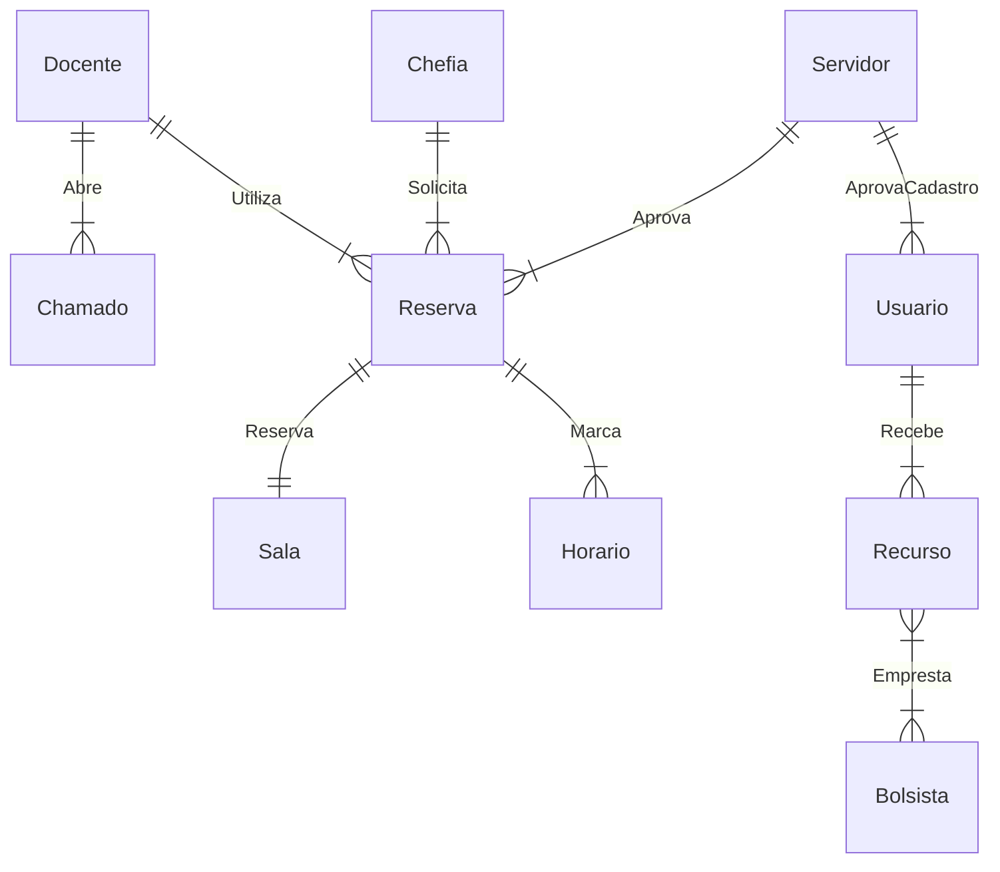

# Modelo ER (Entidade Relacionamento v0.2)

## Listando entidades do projeto

|Entidades |Entidades fracas|Entidades associativas|
|----------|---------|---------|
|Docente   |Chamado  |Abre     |
|Servidor  |Horario  |Aprova   |
|Chefia    |         |Solicita |
|Bolsista  |         |Empresta |
|Recurso   |         |Acompanha|
|Reserva   |         |Marca    |
|          |         |Utiliza  |

[Referências (Lucidchart)](https://www.lucidchart.com/pages/pt/o-que-e-diagrama-entidade-relacionamento)
