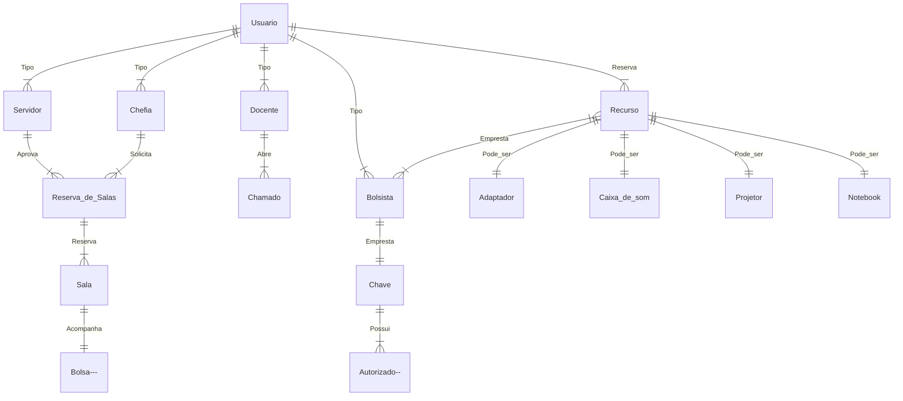

# Modelo ER (Entidade Relacionamento v0.1)

## Listando entidades do projeto

|Entidades normais|Entidades fracas |Entidade associativas|
|------|-----|------|
|Docente|Bolsa|Abre|
|Servidor|Autorização|Aprova|
|Chefia|             |Solicita|
|Bolsista|           |Empresta|
|Recurso|            |Acompanha|

[Referências (Lucidchart)](https://www.lucidchart.com/pages/pt/o-que-e-diagrama-entidade-relacionamento)
