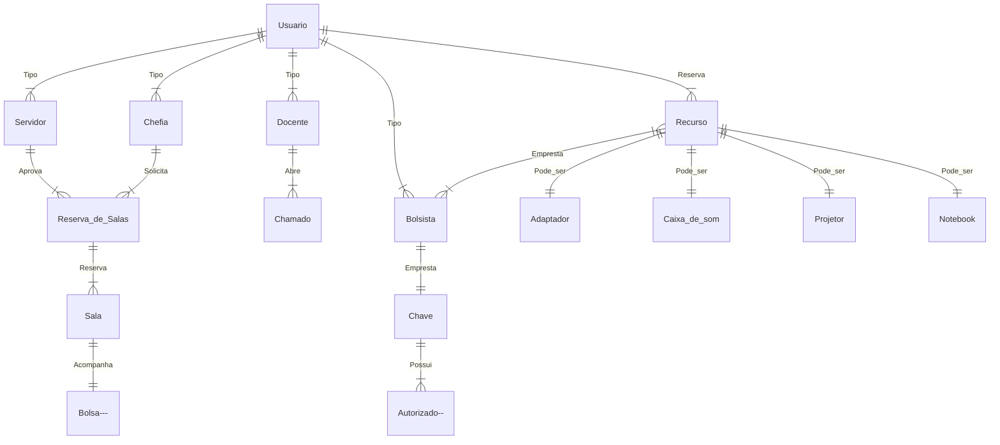

# Modelo ER (Entidade Relacionamento v0.1)

## Componentes e funcionalidades de um diagrama ER

Diagramas ER são compostos de entidades, relacionamentos e atributos. Eles também descrevem a cardinalidade, que define as relações em termos de números.

## Entidade

Algo que pode ser definido e que pode ter dados armazenados sobre ele — como uma pessoa, um objeto, conceito ou evento. Pense em entidades como substantivos.

**Tipo de entidade:** um grupo de coisas definíveis, como estudantes ou atletas, ao passo que a entidade seria um estudante ou atleta específico. Outros exemplos

**Conjunto de entidade:** Assim como um tipo de entidade, mas definido em um determinado ponto no tempo, tal como estudantes matriculados em um curso no primeiro dia de aula.

Outros exemplos: Clientes que fizeram compras no mês passado, carros atualmente registrados na Flórida. Um termo relacionado é **‘instância’**, em que a pessoa ou carro específico (seguindo o exemplo) seria uma instância do conjunto de entidade. É importante diferenciar **o tipo de entidade com o conjunto de entidade.**

## Categorias de entidades

Entidades são categorizadas como: **Entidade forte**, **entidade fraca** ou **entidade associativa.**

 Uma entidade forte pode ser definida unicamente pelos seus próprios atributos, enquanto uma entidade fraca não pode. Uma entidade associativa junta entidades (ou elementos) dentro de um conjunto de entidades. 

## Listando entidades do projeto

|Entidades normais|Entidades fracas |Entidade associativas|
|------|-----|------|
|Docente|Bolsa|Abre|
|Servidor|Autorização|Aprova|
|Chefia|             |Solicita|
|Bolsista|           |Empresta|
|Recurso|            |Acompanha|

[Referências (Lucidchart)](https://www.lucidchart.com/pages/pt/o-que-e-diagrama-entidade-relacionamento)